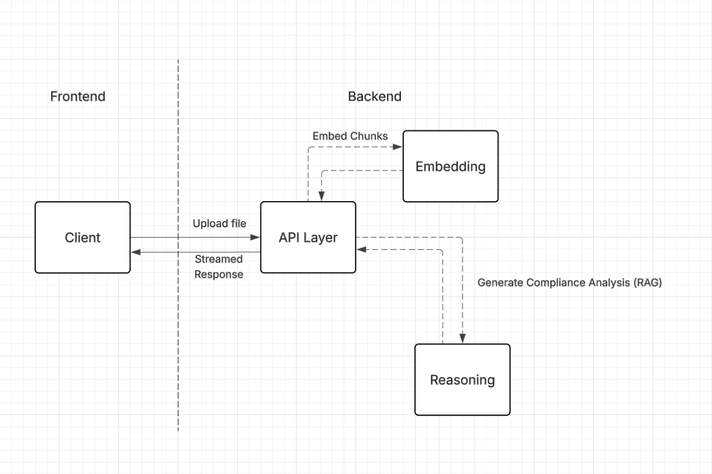

# Sharah
---
**Sharah** is a Shariah compliance validation tool for financial products, focusing on student loans. Users upload a PDF document, and Sharah analyzes them against Islamic finance principles in real-time.

## Technologies
---
### Frontend
* `Vite`
* `React.js`
* `Typescript`
* `Shadcn component library`

### Backend
* `Fast API`
* `Python`
* `Sentence Transformers`
* `Groq AI API`

## Features
---
With Sharah you can
- Upload a PDF file to analyze for shariah compliance based on AAOIFI Shariah Standards.
- Have Analysis results streamed to you in real time.
- Have results be automatically cached during your session, allowing you to see your upload history and view past analyses.

## Architecture
---

## What we learned
---
### RAG:
- Retrieval quality depends on both the knowledge base and the retrieval step. We focused on primarily basing our knowledge base on AAOIFI Shariah Standards, and enriched them with definitions of non-english words as well as relevant examples.

### Embedding Models:
- Sentence embeddings are useful for finding semantically related clauses even when a contract does not use the exact wording found in the rules. Comparing document chunks against several examples for each ruling helped us surface relevant passages, and also highlighted the importance of managing chunk size and the threshold of similarity.

### CustomHooks:
- A custom `useAnalyzeFile` hook kept upload state, streaming, errors, and cache updates out of the presentation components. This made it possible for the UI to render partial results as they arrived while keeping the network and session-storage logic in one place.

### Streaming Reponses & Client Connection:
- The first iteration processed every relevant chunk of the document on the server before returning one complete resposne to the client. Not was this not great for the user experience, but fallback timeouts due to rate-limiting would result in the client closing it's connection. Streaming results as individual chunks are processed feels more responsives to the user as the results can be updated incrementally, and the connection can be kept open to avoid early closure. We also learned that the stream format and error handling must be explicit: one malformed or incomplete message can otherwise interrupt the whole analysis.

## How can it be improved?
---
- **Improve document coverage:** Add additional support for images.
- **Harden the API:** Add authentication and rate limiting for users

## Running the project
---
To run the project in your local environment, follow these steps:
- Clone the repository to your local machine.
- Run `npm install` in the client directory to install the required frontend dependencies.
- Run `pip install` in the sharah-backend directory to install the required backend dependencies.
- Run `npm run dev` in the client directory to start the frontend server, which you can open on http://localhost:5173.
- Run `uvicorn main:app --reload` in the sharah-backend directory to start the backend server.
